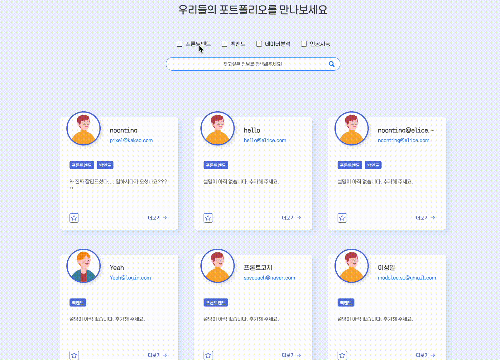

# [WePo] Front-end

##  사용 기술
<div>
  
  
  
  
  
  
  
  
  
  
  
</div>

---

## 기술 사용 이유
### TypeScript
타입을 직접 지정해주고 컴파일 시점에 에러를 잡아 낼 수 있습니다.<br>
자바스크립트는 타입을 런타임 이전이 아닌, 런타임에 동적으로 검사합니다.
그래서 프로그램을 실행해보지 않는 이상 어떤 타입 에러도 잡아낼 수 없습니다.
이런 이유들로 런타임 이전에 정적 타입을 검사할 수 있게 만들고자 사용하게 되었습니다.
### Recoil
`context`를 사용하게 되면 단일 값만 저장할 수 있고 여러 값들의 집합을 담을 수가 없습니다.
그래서 부분적인 상태 변경이 어려워집니다. 별도의 `Provider`를 이용해 랜더링을 제어하려고 해도 자식 요소들 전체를 재랜더링 해야 하고 의도치 않은 문제가 생깁니다.

반면 `Redux`와 `Mobx`의 기능적인 문제는 없습니다. 
하지만 이 상태 관리 라이브러리들은 리액트의 내부 라이브러리가 아니기 때문에
리액트의 가상돔의 내부 로직과는 별개로 동작합니다.
그러니까 `Redux`의 `store`은 리액트의 상태와는 별개의 것이기 때문에
사용할 시 수많은 코드를 통해서 리액트의 상태와 리덕스의 상태를 일치 시키는 작업을 해야 합니다. 
하지만 `recoil`은 `hook`처럼 리액트의 상태를 간단하게 변경하고 이용 가능하다는 이유로 선택하게 되었습니다.
### React-Hook-Form
기존의 폼에서 입력해야 하는 여러가지 번거로운 작업을 줄여줍니다
( value 설정, 데이터 전송 관리 등등 )
입력값에 조건을 달아서 에러를 띄울 수 있습니다.
타입스크립트로 작성된 라이브러리이므로, 타입스크립트와 아주 잘 맞습니다.
불필요한 렌더링을 최소화 합니다.
### React-Query
서버에서 데이터를 받아올때 로딩 중을 없애기 위해서 데이터를 가져올 떄 캐시 값으로 저장해두어서 로딩을 최소화하였습니다.
서버의 값을 클라이언트에 가져오거나, 캐싱, 값 업데이트, 에러핸들링 등
비동기 과정을 더욱 편하게 하는데 사용됩니다
### styled-components
CSS의 컴포넌트화로 스타일시트 파일을 유지보수 할 필요가없다 CSS모델을 문서 레벨이 아닌 컴포넌트 레벨로 추상화한다 (모듈화)
CSS-in-JS는 JavaScript환경을 최대한 활용할 수 있다
props를 활용하여 조건부 스타일링이 가능하다
### Axios
Axios는 promise 기반이기 때문에 데이터를 다루기에 편하고
응답 초과 시간에 대한 처리를 하여 에러 처리를 할 수 있는 부분이 있어 사용하게 되었습니다.

---

## 폴더구조
```
🖥 front
├─ 📁node_modules  -> 사용되는 모듈 폴더
├─ 📁public -> index.html 과 웹에서 표시되는 이미지들 폴더
├─ 📁src -> 전체 소스 폴더
│  ├─ 📁api -> api요청 파일 모음 폴더
│  ├─ 📁components -> 컴포넌트 폴더
│  │  ├─ 📁category
│  │  │  ├─ 📁award  -> Award MVP
│  │  │  ├─ 📁certificate -> Certificate MVP
│  │  │  ├─ 📁education -> Education MVP
│  │  │  └─ 📁project -> Project MVP
│  │  ├─ 📁Modal -> Modal로 띄울 컴포넌트
│  │  ├─ 📁styledComponents -> 중복사용되는 스타일 컴포넌트
│  │  └─ 📁user -> USER와 관련된 컴포넌트들 (회원가입,로그인,유저카드 등)
│  ├─ 📁font -> 웹에 표시되는 폰트폴더
│  └─ 📁theme -> 웹에 기본적인 컬러 폴더
└─ 
```

---

## 주요기능 설명

- ### Login & Register
  - Login Form

    
  - Register Form

    

- ### 나의 페이지
  - CAPE
    - Education
    - Award
    - Certificate
    - Project
      - CAPE Form
      
        

      - 목록

        
    ---
    - 기본 기능
      - 글 추가

        

      - 글 수정

        

      ---
    - 추가기능
      - 글 삭제
      - DND(Drag and Drop)로 항목 순서 변경 가능

        

      - 각 부문의 갯수 확인 가능

        

    ---
  - MyCard
    -  MyCard From 기본

        

    -  MyCard From 편집 버튼 클릭 후

        
    ---
    - 기본 기능
      - 이름 변경
      - 자신에 대한 설명 변경
      ---
    - 추가 기능
      - 이미지 변경 가능
      - 비밀번호 변경 가능
      - 비밀번호 변경 버튼 클릭 시 모달

        

      - 자신의 분야 설정 가능
      - 즐겨찾기에 추가한 목록 보기 가능

        

  ---
  ---

- ### Network
  - 기본 기능
    - UsersCard 확인

        

    - 다른 사람 포트폴리오 자세히 보기 가능
    ---
  - 추가 기능
      - 다른 사람 포트폴리오 즐겨찾기 가능
      - 다른 사람과 다르게 나의 카드는 유닉크하게 `It's Me` 라는 문구가 보임

        

      - 검색 기능 추가
        - UserCard에서 보이는 텍스트는 검색을 통해 확인 가능
        - 영어일 경우 소문자, 대문자 상관없이 검색 가능

          
      
      - 분야 필터 기능 추가
        - 원하는 분야를 체크하여 확인 가능

          
